# Spec Kit 架构图集

本文档包含 Spec Kit 项目的各种架构图，使用 Mermaid 语法绘制。

---

## 一、系统整体架构

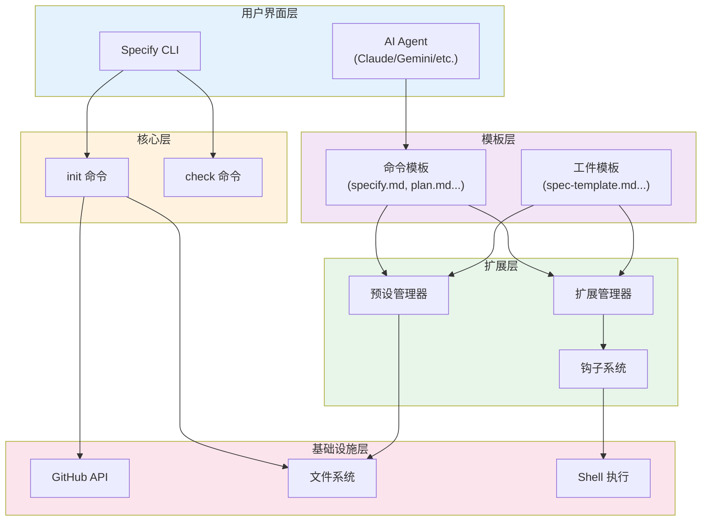

---

## 二、Spec-Driven Development 工作流

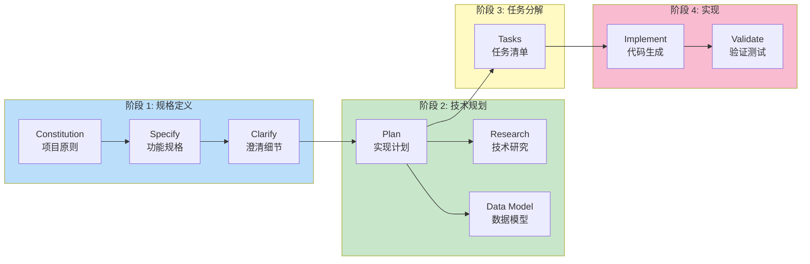

---

## 三、项目初始化流程

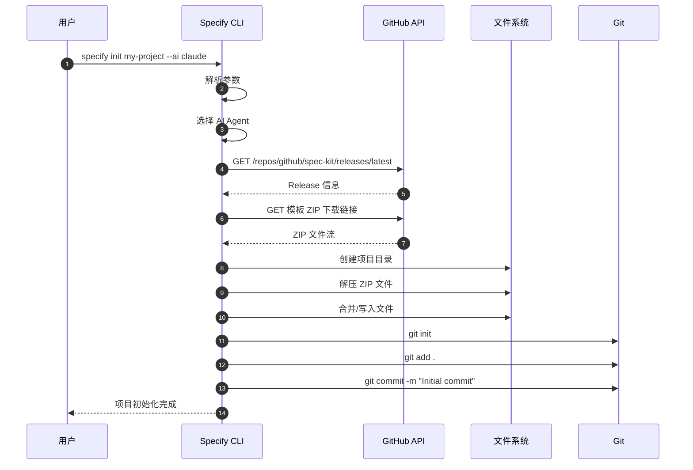

---

## 四、命令执行流程

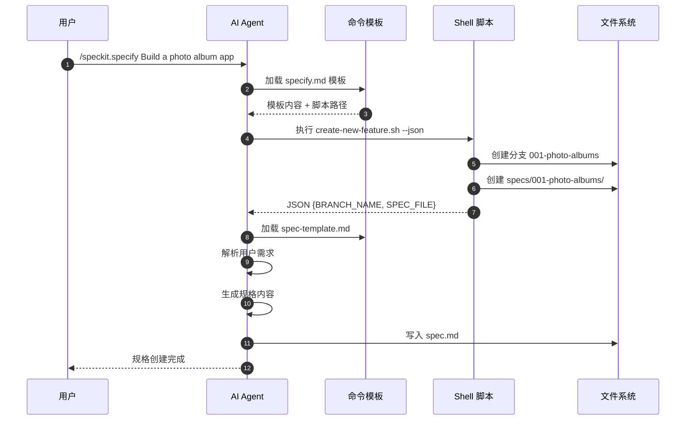

---

## 五、模板解析优先级

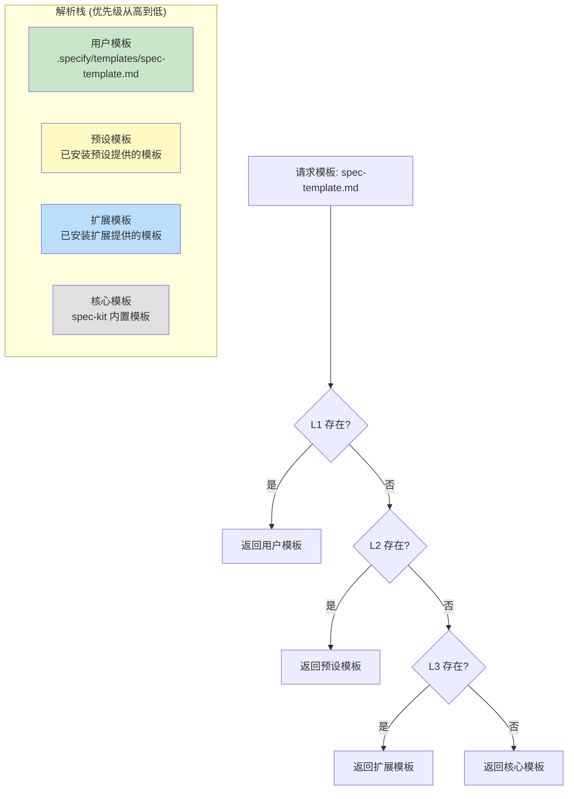

---

## 六、扩展系统架构

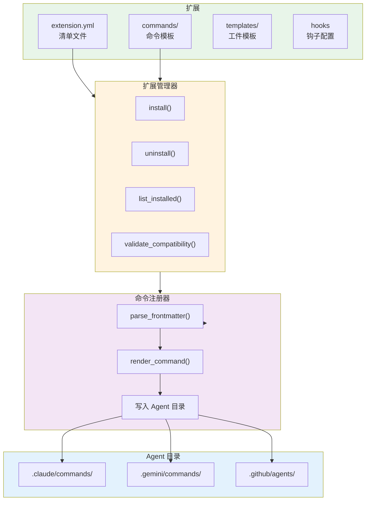

---

## 七、钩子执行机制

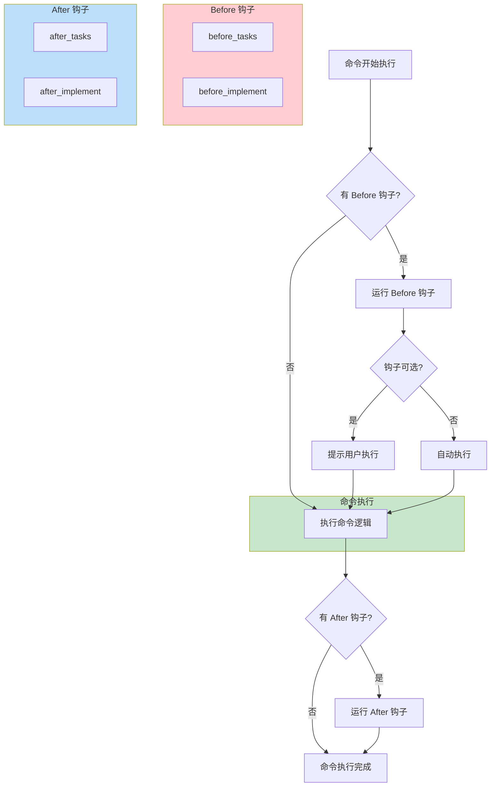

---

## 八、支持的 AI Agent 生态

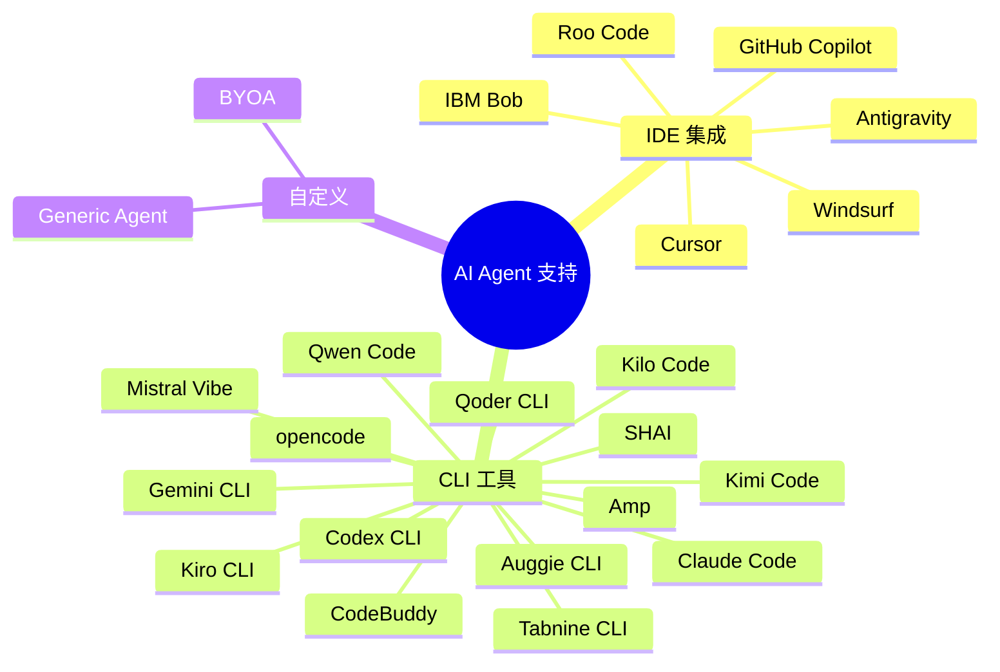

---

## 九、文件产出关系

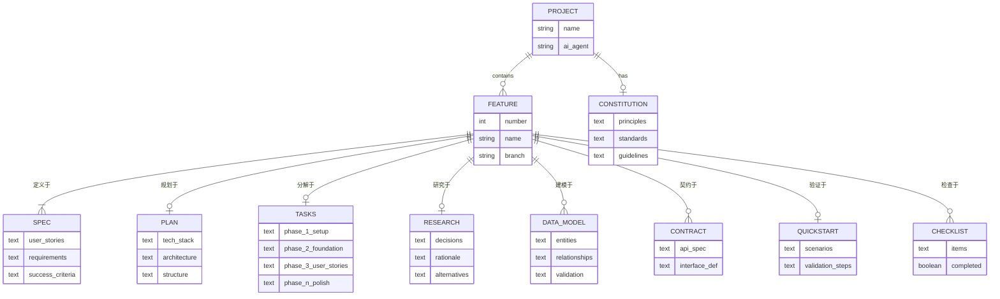

---

## 十、项目目录结构

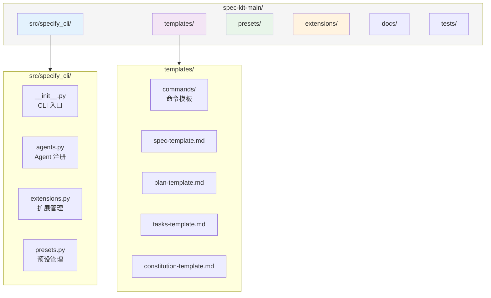

---

## 十一、版本兼容性检查流程

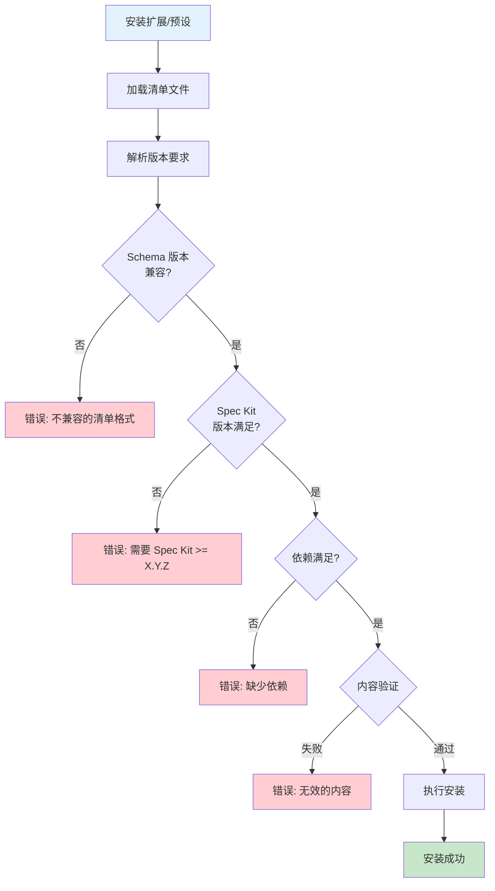

---

## 图表使用说明

以上架构图可以在支持 Mermaid 的 Markdown 渲染器中直接显示，包括：

- GitHub
- GitLab
- VS Code (with Mermaid extension)
- Notion
- Obsidian
- Typora

如需导出为图片，可使用：
- [Mermaid Live Editor](https://mermaid.live/)
- VS Code Mermaid 插件的导出功能